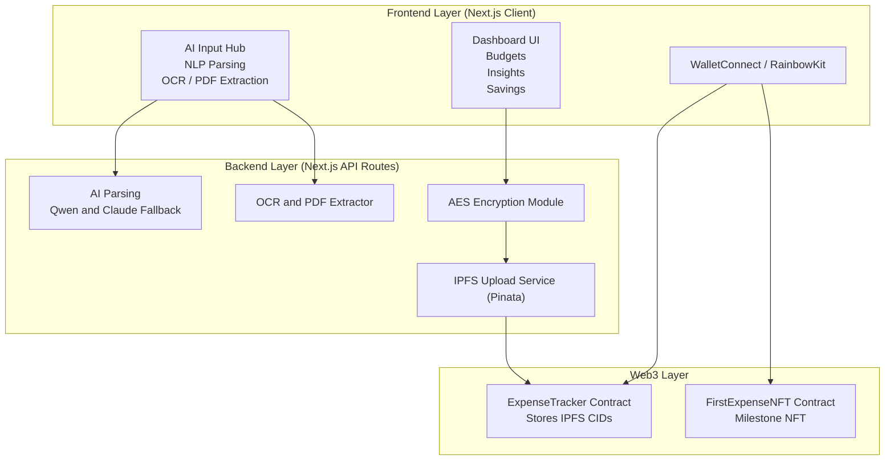

English | [简体中文](README.zh-CN.md)

# LedgerWise – AI Web3 Expense Tracker

A next-generation **AI-powered Web3 expense tracker** built with **Next.js + IPFS + Ethereum**. Own every byte of your financial data, automate bookkeeping with AI, and recover everything from any device through decentralized storage.

## Why Web3 Accounting? (vs Web2)

| Web2 Finance Apps | LedgerWise (Web3) |
| --- | --- |
| Centralized servers store financial history | You own all data (wallet signature = encryption key) |
| Vendor can delete/lose/monetize your data | IPFS + Ethereum make data permanent and verifiable |
| Account recovery relies on email/password | On-chain index + wallet login → instant auto-restore |
| Limited portability | History is portable, censorship-resistant, reusable across Web3 |

## ✨ Core Features

### 🤖 AI Inputs

- Natural language → structured transactions (supports colloquial Chinese such as “今天吃饭30块”).
- OCR for receipts (JPG/PNG/GIF) and PDF parsing to capture amount, merchant, date, and items.
- Multi-file batch import with preview and inline edits.
- AI assistant delivers financial insights and recommendations, with Qwen → Claude fallback for reliability.

### 🗄️ Decentralized Storage & Security

- Wallet signature derives AES keys; data is encrypted client-side before being uploaded to Pinata IPFS.
- CIDs are recorded on Ethereum Sepolia via `ExpenseTracker.sol`, enabling verifiable and auditable history.
- Local cache plus backup/restore modules with validation for reproducible engineering.

### ⛓️ On-Chain Index & Auto-Restore

- Every transaction CID is committed on-chain to guarantee cross-device sync.
- Any new device only needs wallet connection to pull, decrypt, and rebuild the ledger.
- Hooks such as `useExpenseTracker.ts` encapsulate blockchain reads/writes for easy extension.

### 📊 Dashboard & Analytics

- Today’s ledger, monthly stats, top categories, smart budgeting, and savings goals in a single dashboard.
- Chart.js and Recharts power area charts, Sankey-style flows, and progress indicators in real time.
- Financial Health Score and Insights APIs quantify personal finance wellness.

### 🏆 NFT Milestones

- First transaction automatically mints a “First Expense NFT” via `FirstExpenseNFT_V3_Standard.sol`.
- Metadata is stored on IPFS; ownership is verifiable on-chain for gamified onboarding.

### 🔄 Auto-Restore & Data Operations

- Export to CSV, full backup/restore pipelines, and CID history tracking.
- Import supports CSV/Excel/images/PDF with validation, clear error messages, and retry flows.

## 🧱 Tech Stack

- **Frontend**: Next.js 14 (App Router), TypeScript, Tailwind, custom UI components.
- **Web3**: RainbowKit, Wagmi, Viem, Solidity contracts (Sepolia).
- **AI**: Qwen (text + vision) as primary, Claude as fallback; pdf-parse, papaparse, xlsx utilities.
- **Storage & Infra**: Pinata IPFS, CryptoJS AES encryption, LocalStorage, multi-format file parsers.
- **Charts**: Chart.js and Recharts with area, flow, and progress visualizations.

## 🧠 System Architecture


## ⚡ Quick Start
### 1. Install Dependencies
```bash
npm install
```
### 2. Set Up Environment Variables
```bash
cp .env.example .env.local
```
Edit `.env.local`:
```env
QWEN_API_KEY=your_qwen_api_key
CLAUDE_API_KEY=your_claude_api_key   # optional fallback
PINATA_JWT=your_pinata_jwt_token
NEXT_PUBLIC_WALLETCONNECT_PROJECT_ID=your_walletconnect_project_id
NEXT_PUBLIC_TRACKER_CONTRACT_ADDRESS=0xYourExpenseTrackerAddress
NEXT_PUBLIC_NFT_CONTRACT_ADDRESS=0xYourFirstExpenseNFTAddress
```
### 3. Deploy Smart Contracts (Sepolia Testnet)

1. Use Remix to deploy `contracts/ExpenseTracker.sol`, copy the address to `NEXT_PUBLIC_TRACKER_CONTRACT_ADDRESS`.
2. (Optional) Deploy `contracts/FirstExpenseNFT_V3_Standard.sol`, copy the address to `NEXT_PUBLIC_NFT_CONTRACT_ADDRESS`.
3. Ensure your wallet has Sepolia test ETH.

### 4. Run Locally
```bash
npm run dev
```
Open `http://localhost:3000` in your browser, connect your wallet, and start adding expenses via AI input, OCR, or file import.

## 📄 License

MIT
