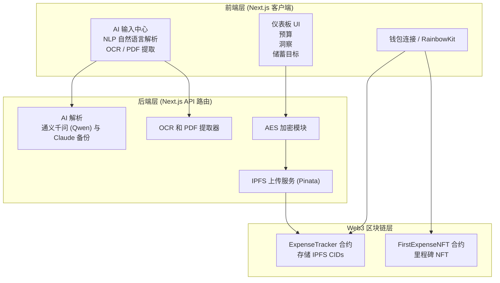

---

### 中文版：`README.zh-CN.md`

[English](README.md) | 简体中文

# LedgerWise｜AI × Web3 去中心化记账应用

一个基于 **Next.js + IPFS + 以太坊** 的 AI Web3 记账工具。  
支持自然语言记账、OCR 扫描、PDF 导入、预算与储蓄管理，并通过链上索引实现 **跨设备自动恢复** 与 **真正的数据所有权**。

---

## 🌐 为什么要用 Web3 来记账？

### 传统 Web2 记账应用的问题

- 数据被中心化服务器托管，平台可随时更改、删除甚至商业化利用用户数据  
- 恢复依赖手机号 / 邮箱，账号安全受平台控制  
- 数据无法跨应用复用，缺乏透明度与可验证性  

### 在 LedgerWise（Web3）中

- 你拥有数据主权：所有数据本地加密，使用 **钱包签名** 作为加密密钥  
- 永不丢失：数据上传到 **IPFS（Pinata）** 去中心化存储  
- 可验证、不可篡改：每条账单的 IPFS CID 上链（**Ethereum Sepolia**）  
- 跨设备自动恢复：连接同一个钱包即可自动找回全部历史记录  
- 匿名 & 隐私友好：无需手机号 / 邮箱 / 密码，无中心化账号体系  

**LedgerWise 的核心价值：让个人财务数据真正回到用户自己手中。**

---

## ✨ 主要功能（Key Features）

### 🤖 AI 智能输入

- 自然语言识别：输入「昨天喝奶茶 18 元」「工资 5000」即可自动解析为结构化账单  
- OCR 图片识别：上传小票照片，自动提取金额、日期、商户、分类等信息  
- PDF 导入：从 PDF 账单中批量提取交易记录  
- 多模型策略：默认使用 **Qwen**，失败或未配置时自动回退到 **Claude API**  
- AI 财务助手：可以直接询问消费结构、趋势分析、储蓄建议、财务健康等问题  

---

### 📥 批量导入 / 导出

- 导入 **CSV / Excel** 账单文件  
- 多张消费图片批量上传并 OCR 解析  
- 多个 PDF 批量解析为交易记录  
- 导入前提供 **预览与手动修正**，保证数据准确  
- 一键 **导出为 CSV**，方便在其他工具中继续分析或备份  

---

### 💰 财务管理能力

- 收入 / 支出管理：支持多种分类，自动归类常见消费类型  
- 月度预算：为不同分类设置预算并展示实时进度条  
- 储蓄目标：创建多个储蓄目标并查看完成进度  
- 财务健康评分：AI 基于消费结构、储蓄率等维度给出评分与建议  
- 分类统计：支持租房、餐饮、购物、交通、娱乐、投资、工资、转账等  

---

### 📊 可视化分析

- 月度消费趋势图  
- Sankey 预算流向图  
- 储蓄进度图  
- 今日交易面板  
- 最大支出类别分析  

---

### 🔐 Web3 & 安全机制

- AES 加密：所有账单数据在浏览器本地加密后再上传  
- IPFS 去中心化存储：使用 **Pinata** 作为网关与存储服务  
- 链上索引：每次数据更新的 IPFS CID 存储在 Ethereum Sepolia 合约中  
- 跨设备自动恢复：更换设备后连接钱包即可恢复所有历史数据  
- 钱包连接：基于 **RainbowKit + Wagmi + MetaMask** 等主流钱包  
- 隐私友好：无手机号 / 邮箱 / 密码，无中心化账号体系  

---

### 🏆 Web3 拓展能力

- NFT 里程碑：首次记账自动获得 “First Expense NFT”  
- 合约透明化：所有历史数据对应的 CID 可在链上公开查询与验证  
- 数据可组合性：未来可被其他 Web3 财务应用或 DeFi 工具复用  

---

## 🛠️ 技术栈（Tech Stack）

### 前端（Frontend）

- Next.js 14（App Router）  
- TypeScript  
- Tailwind CSS  
- Recharts / Chart.js 可视化组件  

### Web3

- RainbowKit、Wagmi、Viem  
- Ethereum Sepolia 测试网  
- Solidity 智能合约：`ExpenseTracker.sol`、`FirstExpenseNFT_V3_Standard.sol`  

### AI

- Qwen（通义千问）作为主模型  
- Claude 作为自动回退模型  

### 存储与加密

- IPFS（Pinata）  
- AES 对称加密（基于钱包签名生成密钥）  

---

## 🔧 系统架构图（Mermaid）


---
### 1. 安装依赖
```bash
npm install
```
### 2. 配置环境变量

```bash
cp .env.example .env.local
```

在 `.env.local` 中添加：

```env
QWEN_API_KEY=your_key
CLAUDE_API_KEY=your_key             # 可选，作为回退模型
PINATA_JWT=your_pinata_token
NEXT_PUBLIC_WALLETCONNECT_PROJECT_ID=your_id
NEXT_PUBLIC_TRACKER_CONTRACT_ADDRESS=0x...
NEXT_PUBLIC_NFT_CONTRACT_ADDRESS=0x...
```

### 3. 启动项目

```npm run dev```
访问：`http://localhost:3000`，连接钱包即可体验自然语言记账、OCR 导入、预算与储蓄等功能。

---

## 📄 License

MIT License
