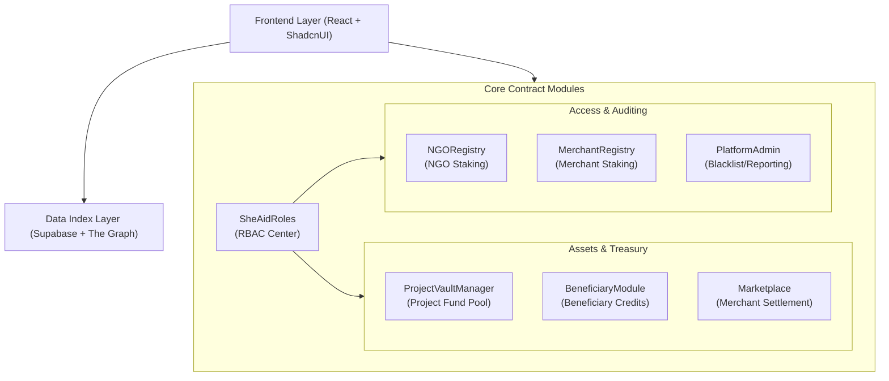

# 🌸 SheAid: Women's Safety Donation Chain Based on Ethereum & DID

[](https://opensource.org/licenses/Apache-2.0)
[](https://github.com/Jasmine-Stars/frontend-genie)
[]()

> **"Code is Law, Tech for Good."**
> 
> Using code to constrain power, encryption to protect dignity, and making goodwill traceable.

## 📖 Introduction

**SheAid** is a Web3 charity infrastructure dedicated to solving the "black box" and "last-mile failure" problems of traditional philanthropy.

In aid scenarios targeting vulnerable women, traditional charity faces three major pain points: **opaque accounting**, **procurement corruption**, and **privacy leakage**. More critically, we have found that direct cash assistance is often expropriated by dominant family members (e.g., abusers) in vulnerable household structures, causing the aid to fail to truly reach the intended beneficiary.

SheAid builds a "Trustless" transparent donation system through **smart contract closed-loop funds**, **DID (Decentralized Identity) privacy protection**, and a **Game Theory risk control model**, ensuring that every penny of charity is safely and transparently converted into physical supplies in the hands of the aided women.

---

## 💡 Core Innovations & Solutions

### 1. 🛡️ "Anti-Deprivation" Fund Loop
Addressing the pain point of **"Nominal Aid, No Actual Control"**:
* **Mechanism:** Donation funds are locked in smart contracts. Beneficiaries receive non-transferable on-chain credits (CharityToken) instead of cash.
* **Closed Loop:** Beneficiaries can only redeem credits for life supplies at whitelisted merchants. The contract settles funds directly to the merchant.
* **Result:** **Funds never pass through the beneficiary's wallet**, technically eliminating the possibility of family members misappropriating the cash.

### 2. ⚖️ Ecological Equilibrium Based on Game Theory
Addressing resource predation in domestic violence environments:
* **Nash Equilibrium Design:** If a dominant family member forcibly interferes with the aid, once reported or detected by an audit, the beneficiary's qualification is permanently removed (Blacklist).
* **Result:** Rational oppressors, in order to secure material benefits for the household (even if it is just the supplies), are forced to compromise and allow the woman to retain control over the resources.

### 3. 💰 "Audit-to-Earn" Economics
* **Universal Staking:** NGOs, Merchants, and Auditors must all stake a security deposit (Stake).
* **Incentive Model:** Anyone can initiate a challenge. Once a violation is verified, the violator's stake is slashed.
* **Fund Distribution:** Slashed funds = **Auditor Rewards** + **Platform Operations** + **Return to Charity Pool**. This realizes a self-sustaining and self-purifying system.

---

## 🏗️ System Architecture

This project adopts a modular contract design separating **"Registry + Logic"** to ensure system security and upgradability.

### Layered View



### Core Contracts Explained

  * **`SheAidRoles.sol`**: RBAC permission management, strictly distinguishing between Admin, NGO, Merchant, and Beneficiary roles.
  * **`ProjectVaultManager.sol`**: Manages the fund pool for each project, ensures dedicated funds for dedicated purposes, and supports refund logic.
  * **`BeneficiaryModule.sol`**: Handles credit issuance, consumption cooldowns, and daily limit risk controls.
  * **`Marketplace.sol`**: Handles merchant product listing, price limit checks (Price Oracle interface), and fund settlement.

-----

## 🚀 MVP Features

✅ **Decentralized Identity**: Supports MetaMask login, automatically identifying Admin/NGO/Merchant/Beneficiary roles.  
✅ **Transparent Donation**: Donors can choose specific projects to fund, with real-time on-chain tracking of fund flows.  
✅ **Project Management**: NGOs must stake funds (120%) to initiate projects, increasing the cost of malicious behavior.  
✅ **Supply Redemption**: Merchants list goods; beneficiaries "purchase" with credits; the contract automatically settles in stablecoins.  
✅ **Dual Risk Control**:

  * **Price Control**: Restricts merchant product price fluctuations.
  * **Behavior Control**: Daily spending limits and cooldown periods for beneficiaries to prevent cash-out schemes.

-----

## 🛠️ Getting Started

### Prerequisites

  * Node.js v18+
  * Git
  * MetaMask (Connected to Sepolia Testnet)

### 1\. Clone the Repo

```bash
git clone [https://github.com/your-username/SheAid.git](https://github.com/your-username/SheAid.git)
cd SheAid
```

### 2\. Install Dependencies

```bash
npm install
# or
bun install
```

### 3\. Configure Environment Variables

Create a `.env` file in the root directory:

```env
VITE_SUPABASE_URL=YourSupabaseURL
VITE_SUPABASE_PUBLISHABLE_KEY=YourSupabaseKey
```

### 4\. Run Frontend

```bash
npm run dev
```

Visit `http://localhost:8080` to view the application.

-----

## 🗺️ Roadmap

### Phase 1: MVP & Core Verification (Current)

  * [x] Complete core contract development and Sepolia deployment.
  * [x] Implement frontend interfaces: Donation, Management, Marketplace, Redemption flows.
  * [x] Basic risk control: Staking mechanism and limit mechanism.

### Phase 2: Privacy Enhancement & Data Empowerment (Q1-Q2 2026)

  * [ ] **ZK-SNARKs Integration**: Introduce Zero-Knowledge Proofs to realize "Anonymous Redemption" for beneficiaries, breaking the link between wallet addresses and real identities.
  * [ ] **Reverse Data Negotiation**: Utilize accumulated on-chain consumption data to guide the platform in negotiating with supply chains to lower commodity prices.

### Phase 3: Open Ecosystem & DAO (Q3 2026+)

  * [ ] **Decentralized Philanthropy**: Allow individuals to initiate aid projects (requiring high staking and community auditing).
  * [ ] **SheAid DAO**: Issue governance tokens; the community votes on slashed fund distribution ratios and blacklist removal.

-----

## 📂 Project Structure

```
src/
├── components/        # UI Components (ShadcnUI)
├── contracts/         # Smart Contract Source (.sol)
│   ├── abis/          # Contract ABI JSON
│   ├── addresses.ts   # Deployed Contract Configuration
│   └── ...
├── hooks/             # React Hooks (Web3, Contracts)
├── pages/             # Route Pages (Admin, NGO, Merchant, Donate...)
├── integrations/      # Third-party Integrations (Supabase)
└── utils/             # Utility Functions
```

-----

## 🤝 Contribution & Contact

As a **cybersecurity graduate student and solo developer**, I deeply understand the importance of security and privacy. This project is not just a technical exercise, but an exploration of using technology to solve social problems.

If you are interested in Web3 charity, smart contract auditing, or privacy computing, Issues and PRs are welcome\!

  * **Developer**: [**Jasmine-Stars**](https://github.com/Jasmine-Stars) / [**SHIEREN** Kiwi](https://github.com/SHIEREN)
  * **Email**: [JasmineLuosx@gmail.com]
  * **Twitter**: [@luo\_jasmin2045](https://x.com/luo_jasmin2045)

-----

> *Built with ❤️ for the voiceless.*

```
```
